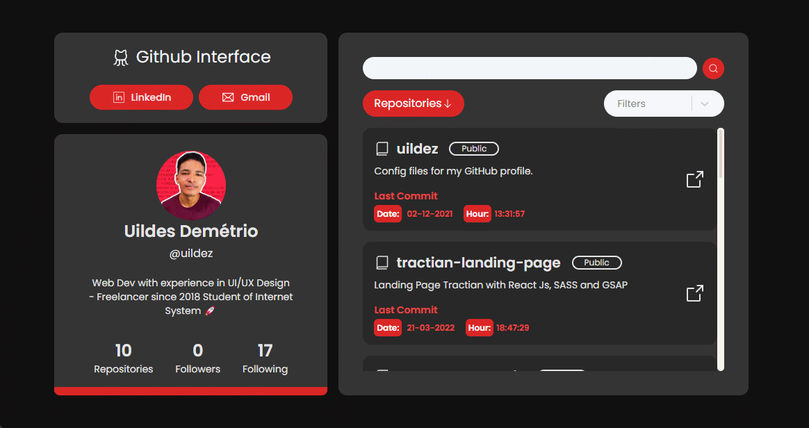

<h1 align="center" color="white">GitHub Application | Listing User Repositories</strong></h1>

<div align="center"></div>
<h2 align="center"><a color="white" href="https://github-application.vercel.app/">Acess Application</a></h2> 

### 📕 About
**GitHub Application | Listing User Repositories** is an application for querying user repositories through Github's Rest API. Built on Vite Create React Js, TailwindCSS, React Select, Date-FNS, Context API and Axios to perform API requests.

### ⚙️ Features
- [x] List Repositories.
- [x] Filter by Archived Repositories.
- [x] Filter by Last Commit.
- [x] Filter by Alphabetical Order.
- [x] Search Repositories by name.


### Prerequisites
```bash
  #### Clone this repository
  $ git clone "https://github.com/uildez/github-application.git"
```

```bash
  #### Install dependencies
  $ npm
```

```bash
  #### Run the application in development mode
  $ npm run dev
```

### 🛠 Technologies
The following tools were used in building the project:
- [React](https://pt-br.reactjs.org/)
- [TailwindCSS](https://tailwindcss.com/docs)
- [Axios](https://axios-http.com/docs/intro)

<h4 align="center">
GitHub Application | Listing User Repositories 
</h4>
